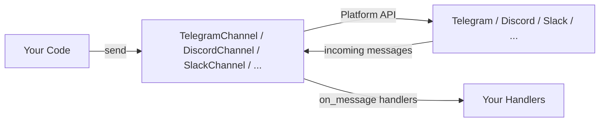

# Channels

The channels module lets OpenJarvis send and receive messages through external messaging platforms. Each platform has a dedicated channel implementation that connects directly to the platform's API -- there is no intermediate gateway.

!!! note "Channels are disabled by default"
    The `[channel]` config section defaults to `enabled = false`. You must set `enabled = true` and configure platform-specific credentials before channel features become active.

---

## Overview

Channel messaging is built around the `BaseChannel` ABC. Each platform (Telegram, Discord, Slack, WhatsApp, etc.) has its own implementation registered via `@ChannelRegistry.register("name")`. Channels connect directly to their platform APIs, register handlers for incoming messages, and send outgoing messages.



---

## Supported Channels

| Channel | Registry Key | Platform | Pip Extra | Auth |
|---------|-------------|----------|-----------|------|
| `SendBlueChannel` | `sendblue` | SendBlue iMessage/SMS API | — | API key + secret |
| `TelegramChannel` | `telegram` | Telegram Bot API | `channel-telegram` | Bot token |
| `DiscordChannel` | `discord` | Discord Bot API | `channel-discord` | Bot token |
| `SlackChannel` | `slack` | Slack Web API | `channel-slack` | Bot + App tokens |
| `WhatsAppChannel` | `whatsapp` | WhatsApp Business API | — | API token |
| `WhatsAppBaileysChannel` | `whatsapp_baileys` | WhatsApp (Baileys) | — | QR code auth |
| `WebhookChannel` | `webhook` | Generic HTTP webhook | — | URL + optional secret |
| `EmailChannel` | `email` | SMTP/IMAP email | — | Email credentials |
| `SignalChannel` | `signal` | Signal Messenger | — | Signal CLI |
| `GoogleChatChannel` | `google_chat` | Google Chat | — | Service account |
| `IRCChannel` | `irc` | IRC | — | Server credentials |
| `WebChatChannel` | `webchat` | Browser-based chat | — | None |
| `TeamsChannel` | `teams` | Microsoft Teams | — | Bot credentials |
| `MatrixChannel` | `matrix` | Matrix protocol | — | Homeserver + token |
| `MattermostChannel` | `mattermost` | Mattermost | — | Bot token |
| `FeishuChannel` | `feishu` | Feishu/Lark | — | App credentials |
| `BlueBubblesChannel` | `bluebubbles` | iMessage (BlueBubbles) | — | BlueBubbles server |
| `LineChannel` | `line` | LINE Messaging API | `channel-line` | Channel access token |
| `ViberChannel` | `viber` | Viber Bot API | `channel-viber` | Auth token |
| `MessengerChannel` | `messenger` | Facebook Messenger | `channel-messenger` | Page access token |
| `RedditChannel` | `reddit` | Reddit API | `channel-reddit` | OAuth credentials |
| `MastodonChannel` | `mastodon` | Mastodon API | `channel-mastodon` | Access token |
| `XMPPChannel` | `xmpp` | XMPP/Jabber | `channel-xmpp` | JID + password |
| `RocketChatChannel` | `rocketchat` | Rocket.Chat API | `channel-rocketchat` | User credentials |
| `ZulipChannel` | `zulip` | Zulip API | `channel-zulip` | Bot email + API key |
| `TwitchChannel` | `twitch` | Twitch IRC/API | `channel-twitch` | OAuth token |
| `NostrChannel` | `nostr` | Nostr protocol | `channel-nostr` | Private key (nsec) |

---

## Using a Channel

### Connecting

```python title="connect.py"
from openjarvis.channels.telegram import TelegramChannel

channel = TelegramChannel(
    bot_token="YOUR_BOT_TOKEN",  # (1)!
)
channel.connect()

print(channel.status())  # ChannelStatus.CONNECTED
```

1. Falls back to the `TELEGRAM_BOT_TOKEN` environment variable if not provided.

### Sending Messages

```python title="send_message.py"
from openjarvis.channels.telegram import TelegramChannel

channel = TelegramChannel()
channel.connect()

# Send to a chat by ID
ok = channel.send(
    "123456789",
    "Analysis complete. Results are ready.",
    conversation_id="thread-abc123",  # optional, for threading
)

if ok:
    print("Message delivered")
else:
    print("Delivery failed")

channel.disconnect()
```

### Receiving Messages

Register handler callbacks before calling `connect()`. Each handler receives a `ChannelMessage` and can optionally return a reply string.

```python title="receive_messages.py"
from openjarvis.channels._stubs import ChannelMessage
from openjarvis.channels.discord_channel import DiscordChannel

channel = DiscordChannel()


def handle_incoming(msg: ChannelMessage) -> None:
    print(f"[{msg.channel}] {msg.sender}: {msg.content}")
    print(f"  conversation_id={msg.conversation_id}")
    print(f"  message_id={msg.message_id}")


channel.on_message(handle_incoming)  # (1)!
channel.connect()                    # (2)!

# Messages now arrive asynchronously via the background listener thread
# Your main thread can continue doing other work
```

1. Register one or more handlers. All registered handlers are called for every incoming message.
2. `connect()` starts the background listener thread after establishing the platform connection.

### Listing Available Channels

```python title="list_channels.py"
from openjarvis.channels.slack import SlackChannel

channel = SlackChannel()
channel.connect()
channels = channel.list_channels()
print(channels)  # ["general", "random", "dev"]
```

### Disconnecting

```python title="disconnect.py"
channel.disconnect()
# Stops the listener thread and closes the platform connection
# Status becomes ChannelStatus.DISCONNECTED
```

---

## ChannelMessage Fields

Every incoming message is delivered to handlers as a `ChannelMessage` dataclass.

| Field | Type | Description |
|-------|------|-------------|
| `channel` | `str` | Name of the channel the message arrived on |
| `sender` | `str` | Identifier of the message sender |
| `content` | `str` | Message text |
| `message_id` | `str` | Unique message identifier (may be empty) |
| `conversation_id` | `str` | Thread/conversation identifier (may be empty) |
| `session_id` | `str` | Session identifier (may be empty) |
| `metadata` | `dict[str, Any]` | Additional platform-specific metadata |

---

## Event Bus Integration

Pass an `EventBus` to publish channel events to the rest of the system:

```python title="channel_events.py"
from openjarvis.core.events import EventBus, EventType
from openjarvis.channels.telegram import TelegramChannel

bus = EventBus()


def on_received(event):
    print(f"Message received on {event.data['channel']}: {event.data['content']}")


def on_sent(event):
    print(f"Message sent to {event.data['channel']}")


bus.subscribe(EventType.CHANNEL_MESSAGE_RECEIVED, on_received)
bus.subscribe(EventType.CHANNEL_MESSAGE_SENT, on_sent)

channel = TelegramChannel(bus=bus)
channel.connect()
```

| Event | Published When | Data Keys |
|-------|----------------|-----------|
| `CHANNEL_MESSAGE_RECEIVED` | A message arrives from the platform | `channel`, `sender`, `content`, `message_id` |
| `CHANNEL_MESSAGE_SENT` | A message is successfully sent | `channel`, `content`, `conversation_id` |

---

## CLI Commands

The `jarvis channel` subcommand group provides quick access to channel operations.

### List Channels

```bash
jarvis channel list
```

### Send a Message

```bash
# Send to a channel by name
jarvis channel send telegram "Build completed successfully"
```

### Show Status

```bash
jarvis channel status
```

---

## API Server Endpoints

When `jarvis serve` is running, three channel endpoints are available. Channels must be configured and enabled in `[channel]` for these endpoints to return data.

### `GET /v1/channels`

Returns the list of registered channels and their status.

```bash
curl http://localhost:8000/v1/channels
```

```json
{
  "channels": ["telegram", "discord", "slack"],
  "status": "connected"
}
```

If no channels are configured:
```json
{"channels": [], "message": "No channels configured"}
```

### `POST /v1/channels/send`

Send a message to a channel.

```bash
curl -X POST http://localhost:8000/v1/channels/send \
  -H "Content-Type: application/json" \
  -d '{"channel": "telegram", "content": "Hello!", "conversation_id": "conv-1"}'
```

```json
{"status": "sent", "channel": "telegram"}
```

Required fields: `channel`, `content`. `conversation_id` is optional.

### `GET /v1/channels/status`

Returns the connection status for each configured channel.

```bash
curl http://localhost:8000/v1/channels/status
```

```json
{"status": "connected"}
```

Possible values: `connected`, `disconnected`, `connecting`, `error`, `not_configured`.

---

## Configuration

Channel settings live in the `[channel]` section of `~/.openjarvis/config.toml`. Each platform has its own nested sub-section.

```toml title="~/.openjarvis/config.toml"
[channel]
enabled = true
default_channel = ""
default_agent = "simple"

[channel.telegram]
bot_token = "YOUR_TELEGRAM_BOT_TOKEN"

[channel.discord]
bot_token = "YOUR_DISCORD_BOT_TOKEN"

[channel.slack]
bot_token = "YOUR_SLACK_BOT_TOKEN"
app_token = "YOUR_SLACK_APP_TOKEN"
```

### Configuration Reference

| Key | Type | Default | Description |
|-----|------|---------|-------------|
| `enabled` | `bool` | `false` | Enable channel messaging |
| `default_channel` | `str` | `""` | Default channel to use when not specified |
| `default_agent` | `str` | `simple` | Agent to use for handling inbound messages |

Platform-specific settings are configured in nested sub-sections (e.g., `[channel.telegram]`, `[channel.discord]`).

---

## Complete Example

This example connects a Telegram channel, registers a handler that echoes messages back, sends a test message, and then disconnects after a short wait.

```python title="full_example.py"
import time
from openjarvis.channels._stubs import ChannelMessage
from openjarvis.channels.telegram import TelegramChannel
from openjarvis.core.events import EventBus

bus = EventBus()
channel = TelegramChannel(
    bot_token="YOUR_BOT_TOKEN",
    bus=bus,
)

received_messages = []


def on_message(msg: ChannelMessage) -> None:
    received_messages.append(msg)
    print(f"Received from {msg.sender} on #{msg.channel}: {msg.content}")


channel.on_message(on_message)
channel.connect()

# List available channels
channels = channel.list_channels()
print(f"Available channels: {channels}")

# Send a message
if channels:
    channel.send(channels[0], "Hello from OpenJarvis!")

# Wait for incoming messages
time.sleep(10)

channel.disconnect()
print(f"Total messages received: {len(received_messages)}")
```

---

## SendBlue (iMessage / SMS)

`SendBlueChannel` is registered as `"sendblue"` in `ChannelRegistry` and gives your agent a **dedicated phone number** that people can text via iMessage (blue bubbles) or SMS. It uses the [SendBlue API](https://docs.sendblue.com/) -- no Apple hardware or BlueBubbles server required.

### How It Works

```
Your phone  ──text──▶  SendBlue  ──webhook──▶  ngrok tunnel  ──▶  OpenJarvis
                                                                       │
Your phone  ◀──iMessage──  SendBlue  ◀──API call──  DeepResearch agent ◀┘
```

When someone texts the SendBlue number, SendBlue POSTs the message to your webhook. OpenJarvis sends an immediate "Message received!" acknowledgment, runs the DeepResearch agent, and sends the response back via iMessage.

### Setup (Browser UI)

The easiest way is through the Agents UI:

1. Go to **Agents → your agent → Messaging** tab
2. Click **Set Up** on "iMessage / SMS"
3. Click **Open SendBlue signup** -- create a free account (no credit card required)
4. In the SendBlue dashboard, copy your **API Key ID** and **API Secret Key**
5. Paste them into the form and click **Verify & Find Number**
6. If on the free tier (shared line), copy the phone number shown under "Send from" in your SendBlue dashboard and paste it
7. Click **Activate Phone Number**

### Tunnel Setup (Required)

Since OpenJarvis runs locally, you need a tunnel so SendBlue can reach your webhook:

```bash
# Install ngrok (one time)
brew install ngrok

# Sign up at https://dashboard.ngrok.com/signup (free)
# Then configure your auth token:
ngrok config add-authtoken YOUR_TOKEN

# Start the tunnel (keep this running)
ngrok http 8222
```

Register the ngrok URL as your SendBlue webhook. You can do this via the API:

```bash
curl -X PUT https://api.sendblue.co/api/account/webhooks \
  -H "sb-api-key-id: YOUR_KEY" \
  -H "sb-api-secret-key: YOUR_SECRET" \
  -H "Content-Type: application/json" \
  -d '{"webhooks": {"receive": ["https://YOUR-NGROK-URL.ngrok-free.dev/webhooks/sendblue"]}}'
```

Or set it in the SendBlue dashboard under **Webhooks**.

### SendBlue Free Tier Notes

- **Shared line**: Your agent uses a shared phone number (no dedicated number)
- **Verified contacts only**: Recipients must be added as verified contacts in the SendBlue dashboard first
- **10 contacts max**: Free tier allows up to 10 verified contacts
- **iMessage preferred**: SendBlue sends via iMessage when possible, falls back to SMS

To get a dedicated number, upgrade to a paid SendBlue plan.

### Programmatic Setup

```python title="sendblue_setup.py"
from openjarvis.channels.sendblue import SendBlueChannel

channel = SendBlueChannel(
    api_key_id="YOUR_API_KEY_ID",         # or SENDBLUE_API_KEY_ID env var
    api_secret_key="YOUR_API_SECRET_KEY", # or SENDBLUE_API_SECRET_KEY env var
    from_number="+16452468235",           # or SENDBLUE_FROM_NUMBER env var
)
channel.connect()

# Send a message
ok = channel.send("+15551234567", "Hello from OpenJarvis!")
```

### Webhook Endpoint

The server exposes `POST /webhooks/sendblue` which:

1. Sends an instant acknowledgment: "Message received! Researching your data now..."
2. Routes the message to the DeepResearch agent via the ChannelBridge
3. If processing takes >45 seconds, sends: "Still working -- complex query, hang tight..."
4. Sends the full research response back via iMessage/SMS

### Constructor Parameters

| Parameter | Type | Default | Description |
|-----------|------|---------|-------------|
| `api_key_id` | `str` | `""` | SendBlue API key ID (falls back to `SENDBLUE_API_KEY_ID` env var) |
| `api_secret_key` | `str` | `""` | SendBlue API secret key (falls back to `SENDBLUE_API_SECRET_KEY` env var) |
| `from_number` | `str` | `""` | SendBlue phone number to send from (falls back to `SENDBLUE_FROM_NUMBER` env var) |
| `webhook_secret` | `str` | `""` | Optional secret for verifying incoming webhook requests |
| `bus` | `EventBus` | `None` | Event bus for publishing channel events |

### Configuration

```toml title="~/.openjarvis/config.toml"
[channel.sendblue]
api_key_id = "YOUR_API_KEY_ID"
api_secret_key = "YOUR_API_SECRET_KEY"
from_number = "+16452468235"
```

### CLI Usage

```bash
# Set credentials via environment variables
export SENDBLUE_API_KEY_ID="your_key"
export SENDBLUE_API_SECRET_KEY="your_secret"
export SENDBLUE_FROM_NUMBER="+16452468235"

# Check channel status
jarvis channel status --channel-type sendblue

# Send a message
jarvis channel send sendblue "+15551234567" "Hello from Jarvis!"
```

### Server Restart Behavior

SendBlue bindings are **automatically restored on server restart**. When `jarvis serve` starts:

1. The server checks the database for existing SendBlue channel bindings
2. Re-creates the `SendBlueChannel` instance with stored credentials
3. Re-wires the `ChannelBridge` with a `DeepResearchAgent`
4. Incoming webhooks resume working immediately

**However, if using ngrok:** The tunnel URL changes on every ngrok restart. You must re-register the new URL with SendBlue:

```bash
# Start ngrok (get new URL)
ngrok http 8222

# Register the new webhook URL
curl -X PUT https://api.sendblue.co/api/account/webhooks \
  -H "sb-api-key-id: YOUR_KEY" \
  -H "sb-api-secret-key: YOUR_SECRET" \
  -H "Content-Type: application/json" \
  -d '{"webhooks": {"receive": ["https://NEW-NGROK-URL.ngrok-free.dev/webhooks/sendblue"]}}'
```

!!! tip "Stable tunnel URL"
    Ngrok paid plans provide a fixed subdomain that persists across restarts. Alternatively, use [Cloudflare Tunnel](https://developers.cloudflare.com/cloudflare-one/connections/connect-networks/) for a free, stable URL.

### Troubleshooting

| Symptom | Cause | Fix |
|---------|-------|-----|
| "Message received!" ack sent but no response | DeepResearch agent timed out or errored | Check server logs for errors |
| No ack, no response | Webhook URL not reachable | Verify ngrok is running; re-register webhook URL |
| "Disconnected" badge in Messaging tab | Server restarted without restoring bindings | Click "Reconnect" in the UI |
| SendBlue returns 401 | Invalid API credentials | Re-enter API key and secret in Messaging tab |
| "Contacts must text this number first" | Free tier requires verified contacts | Add the recipient in SendBlue dashboard under Contacts |
| Messages arrive but are not processed | Channel bridge not wired | Remove and re-add the SendBlue binding in Messaging tab |

### Health Check

The server exposes `GET /v1/channels/sendblue/health` which returns:

```json
{
  "channel_connected": true,
  "bridge_wired": true,
  "ready": true
}
```

If `ready` is `false`, the Messaging tab shows a "Disconnected" badge with a "Reconnect" button.

---

## WhatsAppBaileysChannel

`WhatsAppBaileysChannel` is registered as `"whatsapp_baileys"` in `ChannelRegistry` and provides **bidirectional WhatsApp messaging** using the Baileys protocol. It spawns a Node.js bridge subprocess that handles QR-code authentication, incoming message forwarding, and outbound message delivery.

!!! warning "Node.js 22+ required"
    The Baileys bridge is a compiled Node.js application bundled inside the package. It is auto-installed to `~/.openjarvis/whatsapp_baileys_bridge/` on first `connect()` call. If `node` is not found on `PATH`, `connect()` logs an error and sets the channel to `ChannelStatus.ERROR`.

!!! note "WhatsApp account required"
    WhatsApp does not offer an official API for personal accounts. Baileys operates on the WhatsApp Web protocol. You must scan a QR code with your WhatsApp mobile app to authenticate on first use.

### Connecting

```python title="whatsapp_connect.py"
from openjarvis.channels.whatsapp_baileys import WhatsAppBaileysChannel

channel = WhatsAppBaileysChannel(
    assistant_name="Jarvis",           # (1)!
    assistant_has_own_number=False,    # (2)!
)
channel.connect()  # spawns the Node.js bridge subprocess
```

1. Display name used in conversation context.
2. Set `True` if the assistant has a dedicated WhatsApp number and should not filter its own messages.

On first connection, the bridge will print a QR code to the terminal. Scan it with the WhatsApp app on your phone to authenticate. Authentication state is saved to `~/.openjarvis/whatsapp_baileys_bridge/auth/` and reused on subsequent connections.

### Receiving Messages

```python title="whatsapp_receive.py"
from openjarvis.channels._stubs import ChannelMessage
from openjarvis.channels.whatsapp_baileys import WhatsAppBaileysChannel

channel = WhatsAppBaileysChannel()


def on_message(msg: ChannelMessage) -> None:
    print(f"[{msg.sender}] {msg.content}")
    # msg.conversation_id is the WhatsApp JID (e.g. "15551234567@s.whatsapp.net")


channel.on_message(on_message)
channel.connect()

# Background reader thread is running; your code continues here
```

### Sending Messages

Messages are addressed by WhatsApp **JID** (Jabber ID) -- the canonical identifier for a WhatsApp contact or group.

```python title="whatsapp_send.py"
# Individual contact JID format: <country-code><number>@s.whatsapp.net
# Group JID format: <group-id>@g.us

ok = channel.send(
    "15551234567@s.whatsapp.net",      # JID of the recipient
    "Hello from OpenJarvis!",
)

if not ok:
    print("Send failed -- check that the bridge is connected")
```

### Disconnecting

```python title="whatsapp_disconnect.py"
channel.disconnect()
# Sends disconnect command to bridge, terminates subprocess, stops reader thread
```

### Constructor Parameters

| Parameter                  | Type       | Default     | Description                                            |
|----------------------------|------------|-------------|--------------------------------------------------------|
| `auth_dir`                 | `str`      | `~/.openjarvis/whatsapp_baileys_bridge/auth` | Baileys auth state directory |
| `assistant_name`           | `str`      | `"Jarvis"`  | Display name for the assistant                         |
| `assistant_has_own_number` | `bool`     | `False`     | Whether the assistant has a dedicated WhatsApp number  |
| `bus`                      | `EventBus` | `None`      | Event bus for publishing channel events                |

### Bridge Events

The Node.js bridge communicates with Python via JSON lines on stdio. Python interprets the following event types:

| Bridge event type | Effect                                                      |
|-------------------|-------------------------------------------------------------|
| `status`          | Updates `ChannelStatus` (`connected` / `disconnected`)      |
| `qr`              | Logs "QR code received -- scan to authenticate"             |
| `message`         | Dispatches to all registered `on_message` handlers          |
| `error`           | Logs the error and sets status to `ChannelStatus.ERROR`     |

### Event Bus Integration

When a `bus` is provided, `WhatsAppBaileysChannel` publishes the same events as other channels:

| Event | Published When | Data Keys |
|-------|----------------|-----------|
| `CHANNEL_MESSAGE_RECEIVED` | An inbound WhatsApp message arrives | `channel`, `sender`, `content`, `message_id` |
| `CHANNEL_MESSAGE_SENT` | A message is successfully sent | `channel`, `content`, `conversation_id` |

### Configuration

WhatsApp Baileys channel settings live in the `[channel.whatsapp_baileys]` subsection:

```toml title="~/.openjarvis/config.toml"
[channel.whatsapp_baileys]
auth_dir = "/home/user/.openjarvis/whatsapp_baileys_bridge/auth"
assistant_name = "Jarvis"
assistant_has_own_number = false
```

---

## See Also

- [Architecture: Channels](../architecture/channels.md) -- listener loop internals and channel design
- [API Reference: Channels](../api-reference/openjarvis/channels/index.md) -- full class and type signatures
- [Getting Started: Configuration](../getting-started/configuration.md) -- full config reference
- [User Guide: Agents](agents.md) -- agent system documentation
